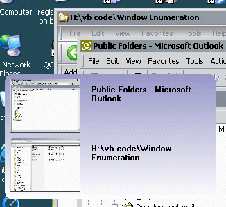



## Collect ur running apps into screenshots and switch to them \(win enumeration\)

### Description

Using Windows enumeration, this app collects all the running applications, screen scrapes them into thumbnails. Then click on the thumbnail to switch to the application. Only works on XP so far (am working on it!). There's a lot of window API work in here and as always a working example is a great tutorial. enjoy.
 
### More Info
 

             |
---                |---
**Submitted On**   |2003-12-18 09:55:04
**By**             |[Fosters](https://github.com/Planet-Source-Code/PSCIndex/blob/master/ByAuthor/fosters.md)
**Level**          |Advanced
**User Rating**    |4.9 (34 globes from 7 users)
**Compatibility**  |VB 6\.0
**Category**       |[Complete Applications](https://github.com/Planet-Source-Code/PSCIndex/blob/master/ByCategory/complete-applications__1-27.md)
**World**          |[Visual Basic](https://github.com/Planet-Source-Code/PSCIndex/blob/master/ByWorld/visual-basic.md)
**Archive File**   |[Collect\_ur16852912192003\.zip](https://github.com/Planet-Source-Code/fosters-collect-ur-running-apps-into-screenshots-and-switch-to-them-win-enumeration__1-50526/archive/master.zip)

